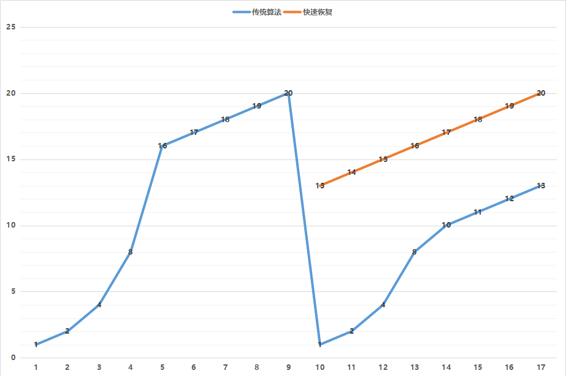

### TCP 下

为了保证顺序性，每一个包都有一个 ID。在建立连接的时候，会商定起始的 ID 是什么，然后按照 ID 一个个发送。为了保证不丢包，对于发送的包都要进行应答，但是这个应答也不是一个一个来的，而是会应答某个之前的 ID，表示都收到了，这种模式称为累计确认或者累计应答（cumulative acknowledgment）。

为了记录所有发送的包和接收的包，TCP 也需要发送端和接收端分别都有缓存来保存这些记录。发送端的缓存里是按照包的 ID 一个个排列，根据处理的情况分成四个部分。

第一部分：发送了并且已经确认的。这部分就是你交代接收端的，并且也做完了的，应该划掉的。

第二部分：发送了并且尚未确认的。这部分是你交代接收端的，但是还没做完的，需要等待做完的回复之后，才能划掉。

第三部分：没有发送，但是已经等待发送的。这部分是你还没有交代给接收端，但是马上就要交代的。

第四部分：没有发送，并且暂时还不会发送的。这部分是你还没有交代给接收端，而且暂时还不会交代给接收端的。

1.  这里面为什么要区分第三部分和第四部分呢？没交代的，一下子全交代了不就完了吗？

    因为`流量控制，把握分寸`;

    作为项目管理人员，你应该根据以往的工作情况和这个员工反馈的能力、抗压力等，先在心中估测一下，这个人一天能做多少工作。如果工作布置少了，就会不饱和；如果工作布置多了，他就会做不完；如果你使劲逼迫，人家可能就要辞职了。

到底一个员工能够同时处理多少事情呢？在 TCP 里，接收端会给发送端报一个窗口的大小，叫 `Advertised window`。这个窗口的大小应该等于上面的第二部分加上第三部分，就是已经交代了没做完的加上马上要交代的。超过这个窗口的，接收端做不过来，就不能发送了。

于是，发送端需要保持下面的数据结构。

- LastByteAcked：第一部分和第二部分的分界线

- LastByteSent：第二部分和第三部分的分界线

- LastByteAcked + AdvertisedWindow：第三部分和第四部分的分界线

对于接收端来讲，它的缓存里记录的内容要简单一些。

第一部分：接受并且确认过的。也就是我领导交代给我，并且我做完的。

第二部分：还没接收，但是马上就能接收的。也即是我自己的能够接受的最大工作量。

第三部分：还没接收，也没法接收的。也即超过工作量的部分，实在做不完。

对应的数据结构就像这样。

- MaxRcvBuffer：最大缓存的量；

- LastByteRead 之后是已经接收了，但是还没被应用层读取的；

- NextByteExpected 是第一部分和第二部分的分界线。

第二部分的窗口有多大呢？

也就是：AdvertisedWindow = MaxRcvBuffer-( (NextByteExpected - 1) - LastByteRead)。

NextByteExpected 上图其实是 6 , 目前收到的是 5, 那下一个期待是 6;
AdvertisedWindow = 14 - ( (6 - 1) - 0); 等于 9;

其中第二部分里面，由于受到的包可能不是顺序的，会出现空挡 (6, 7 是虚线, 代表是空的)，只有和第一部分连续的，可以马上进行回复，中间空着的部分需要等待，哪怕后面的已经来了。

### 顺序问题与丢包问题

结合上面两张图:

在发送端来看，1、2、3 已经发送并确认；4、5、6、7、8、9 都是发送了还没确认；10、11、12 是还没发出的；13、14、15 是接收方没有空间，不准备发的。

在接收端来看，1、2、3、4、5 是已经完成 ACK，但是没读取的；6、7 是等待接收的；8、9 是已经接收，但是没有 ACK 的。

根据这个例子，我们可以知道，顺序问题和丢包问题都有可能发生，所以我们先来看`确认与重发的机制`。

1.  超时重试

    也即对每一个发送了，但是没有 ACK 的包，都有设一个定时器，超过了一定的时间，就重新尝试。
    但是这个超时的时间如何评估呢？这个时间不宜过短，时间必须大于往返时间 RTT，否则会引起不必要的重传。也不宜过长，这样超时时间变长，访问就变慢了。

    估计往返时间，需要 TCP 通过采样 RTT 的时间，然后进行加权平均，算出一个值，而且这个值还是要不断变化的，因为网络状况不断的变化。除了采样 RTT，还要采样 RTT 的波动范围，计算出一个估计的超时时间。由于重传时间是不断变化的，我们称为自适应重传算法（Adaptive Retransmission Algorithm）。

    如果过一段时间，5、6、7 都超时了，就会重新发送。接收方发现 5 原来接收过，于是丢弃 5；6 收到了，发送 ACK，要求下一个是 7，7 不幸又丢了。当 7 再次超时的时候，有需要重传的时候，TCP 的策略是超时间隔加倍。每当遇到一次超时重传的时候，都会将下一次超时时间间隔设为先前值的两倍。两次超时，就说明网络环境差，不宜频繁反复发送。

超时触发重传存在的问题是，超时周期可能相对较长。那是不是可以有更快的方式呢？

1.  快速重传算法

    有一个可以快速重传的机制，当接收方收到一个序号大于下一个所期望的报文段时，就检测到了数据流中的一个间格，于是发送三个冗余的 ACK，客户端收到后，就在定时器过期之前，重传丢失的报文段。

    例如，接收方发现 6、8、9 都已经接收了，就是 7 没来，那肯定是丢了，于是发送三个 6 的 ACK，要求下一个是 7。客户端收到 3 个，就会发现 7 的确又丢了，不等超时，马上重发。

    还有一种方式称为 Selective Acknowledgment （SACK）。这种方式需要在 TCP 头里加一个 SACK 的东西，可以将缓存的地图发送给发送方。例如可以发送 ACK6、SACK8、SACK9，有了地图，发送方一下子就能看出来是 7 丢了。

### 流量控制问题

我们再来看流量控制机制，在对于包的确认中，同时会携带一个窗口的大小。

我们先假设窗口不变的情况，窗口(大小)始终为 9。4 的确认(ACK)来的时候，会右移一个，这个时候第 13 个包也可以发送了。

如果接收方实在处理的太慢，导致缓存中没有空间了，可以通过确认信息修改窗口的大小，甚至可以设置为 0，则发送方将暂时停止发送。

如果这样的话，发送方会定时发送窗口`探测数据包`，看是否有机会调整窗口的大小。当接收方比较慢的时候，要防止低能窗口综合征，别空出一个字节来就赶快告诉发送方，然后马上又填满了，可以当窗口太小的时候，不更新窗口，直到达到一定大小，或者缓冲区一半为空，才更新窗口。

### 拥塞控制问题

也是通过窗口的大小来控制的，前面的滑动窗口 rwnd (receive window) 是怕发送方把接收方缓存塞满，而拥塞窗口 cwnd (congestion window)，是怕把网络塞满。

这里有一个公式 LastByteSent - LastByteAcked <= min {cwnd, rwnd} ，是拥塞窗口和滑动窗口共同控制发送的速度。

1.  那发送方怎么判断网络是不是满呢？

    这其实是个挺难的事情，因为对于 TCP 协议来讲，他压根不知道整个网络路径都会经历什么，对他来讲就是一个黑盒。TCP 发送包常被比喻为往一个水管里面灌水，而 TCP 的拥塞控制就是在不堵塞，不丢包的情况下，尽量发挥带宽。

    水管有粗细，网络有带宽，也即每秒钟能够发送多少数据；水管有长度，端到端有时延。在理想状态下，水管里面水的量 = 水管粗细 x 水管长度。对于到网络上，通道的容量 = 带宽 × 往返延迟。

    如果我们设置发送窗口，使得发送但未确认的包为为通道的容量，就能够撑满整个管道。

如图所示，假设往返时间为 8s，去 4s，回 4s，每秒发送一个包，每个包 1024byte。已经过去了 8s，则 8 个包都发出去了，其中前 4 个包已经到达接收端，但是 ACK 还没有返回，不能算发送成功。5-8 后四个包还在路上，还没被接收。这个时候，整个管道正好撑满，在发送端，已发送未确认的为 8 个包，正好等于带宽，也即每秒发送 1 个包，乘以来回时间 8s。

1.  如果我们在这个基础上再调大窗口，使得单位时间内更多的包可以发送，会出现什么现象呢？

    多出来的包就会被丢弃

    我们来想，原来发送一个包，从一端到达另一端，假设一共经过四个设备，每个设备处理一个包时间耗费 1s，所以到达另一端需要耗费 4s，如果发送的更加快速，则单位时间内，会有更多的包到达这些中间设备，这些设备还是只能每秒处理一个包的话，多出来的包就会被丢弃，这是我们不想看到的。

    这个时候，我们可以想其他的办法，例如这个四个设备本来每秒处理一个包，但是我们在这些设备上加缓存，处理不过来的在队列里面排着，这样包就不会丢失，但是缺点是会增加时延，这个缓存的包，4s 肯定到达不了接收端了，如果时延达到一定程度，就会超时重传，也是我们不想看到的。

于是 TCP 的拥塞控制主要来避免两种现象，`包丢失`和`超时重传`

1.  但是一开始我怎么知道速度多快呢，我怎么知道应该把窗口调整到多大呢？

    如果我们通过漏斗往瓶子里灌水，我们就知道，不能一桶水一下子倒进去，肯定会溅出来，要一开始慢慢的倒，然后发现总能够倒进去，就可以越倒越快。这叫作慢启动。

    一条 TCP 连接开始，cwnd 设置为一个报文段，一次只能发送一个；当收到这一个确认的时候，cwnd 加一，于是一次能够发送两个；当这两个的确认到来的时候，每个确认 cwnd 加一，两个确认 cwnd 加二，于是一次能够发送四个；当这四个的确认到来的时候，每个确认 cwnd 加一，四个确认 cwnd 加四，于是一次能够发送八个。可以看出这是`指数性的增长`。

    涨到什么时候是个头呢？有一个值 ssthresh 为 65535 个字节，当超过这个值的时候，就要小心一点了，不能倒这么快了，可能快满了，再慢下来。

    每收到一个确认后，cwnd 增加 1/cwnd，我们接着上面的过程来，一次发送八个，当八个确认到来的时候，每个确认增加 1/8，八个确认一共 cwnd 增加 1，于是一次能够发送九个，变成了`线性增长`。

拥塞的一种表现形式是丢包，需要超时重传，这个时候，将 sshresh 设为 cwnd/2，将 cwnd 设为 1，重新开始慢启动。这真是一旦超时重传，马上回到解放前。但是这种方式太激进了，将一个高速的传输速度一下子停了下来，会造成网络卡顿。

前面我们讲过快速重传算法。当接收端发现丢了一个中间包的时候，发送三次前一个包的 ACK，于是发送端就会快速的重传，不必等待超时再重传。TCP 认为这种情况不严重，因为大部分没丢，只丢了一小部分，cwnd 减半为 cwnd/2，然后 sshthresh = cwnd，当三个包返回的时候，cwnd = sshthresh + 3，也就是没有一夜回到解放前，而是还在比较高的值，呈线性增长。

TCP 的拥塞控制主要来避免的两个现象本身都是有问题的。

`第一个问题`是丢包并不代表着通道满了，也可能是管子本来就漏水。例如公网上带宽不满也会丢包，这个时候就认为拥塞了，退缩了，其实是不对的。

`第二个问题`是 TCP 的拥塞控制要等到将中间设备都填充满了，才发生丢包，从而降低速度，这时候已经晚了。其实 TCP 只要填满管道就可以了，不应该接着填，直到连缓存也填满。

为了优化这两个问题，后来有了 TCP BBR 拥塞算法。它企图找到一个平衡点，就是通过不断的加快发送速度，将管道填满，但是不要填满中间设备的缓存，因为这样时延会增加，在这个平衡点可以很好的达到高带宽和低时延的平衡。

### 小结

- 顺序问题、丢包问题、流量控制都是通过滑动窗口来解决的，

  这其实就相当于你领导和你的工作备忘录，布置过的工作要有编号，干完了有反馈，活不能派太多，也不能太少

- 拥塞控制是通过拥塞窗口来解决的

  相当于往管道里面倒水，快了容易溢出，慢了浪费带宽，要摸着石头过河，找到最优值。

### 问题

1.  TCP 的 BBR 听起来很牛，你知道他是如何达到这个最优点的嘛？

    S1：慢启动开始时，以前期的延迟时间为延迟最小值 Tmin。然后监控延迟值是否达到 Tmin 的 n 倍，达到这个阀值后，判断带宽已经消耗尽且使用了一定的缓存，进入排空阶段。

    S2：指数降低发送速率，直至延迟不再降低。这个过程的原理同 S1

    S3：协议进入稳定运行状态。交替探测带宽和延迟，且大多数时间下都处于带宽探测阶段。

1.  学会了 UDP 和 TCP，你知道如何基于这两种协议写程序吗？这样的程序会有什么坑呢？

    TCP 优点在于准确到达，可靠性高，但是速度慢；UDP 优点在于简单，但是不确认可达；

    像后端接口一般使用 TCP 协议，因为客户端和服务器之间会有多次交互，且请求数据要确认可达；

    直播可以考虑 UDP, 对数据准确性和丢包要求比较低，但速度必须快, 用户等急了可不行; 丢个一两帧, 用户也能接受; 直播如果使用 TCP, 那么延时可能会比较高, 因为要保证有序,拥塞控制等等
