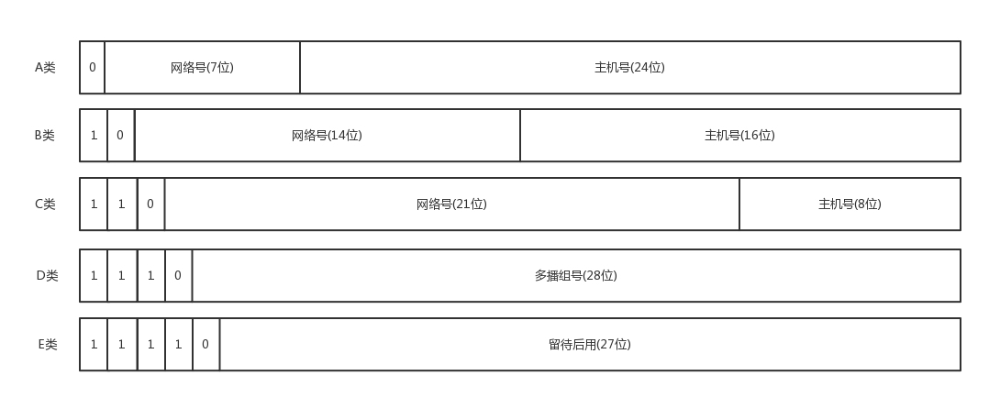

### ifconfig

```bash
ip addr
# 显示这台机器上所有的网卡
# 大部分的网卡都会有一个 IP 地址，当然，这不是必须的
```

```text
1: lo: <LOOPBACK,UP,LOWER_UP> mtu 65536 qdisc noqueue state UNKNOWN group default
    link/loopback 00:00:00:00:00:00 brd 00:00:00:00:00:00
    inet 127.0.0.1/8 scope host lo
       valid_lft forever preferred_lft forever
    inet6 ::1/128 scope host
       valid_lft forever preferred_lft forever
2: eth0: <BROADCAST,MULTICAST,UP,LOWER_UP> mtu 1500 qdisc pfifo_fast state UP group default qlen 1000
    link/ether fa:16:3e:c7:79:75 brd ff:ff:ff:ff:ff:ff
    inet 10.100.122.2/24 brd 10.100.122.255 scope global eth0
       valid_lft forever preferred_lft forever
    inet6 fe80::f816:3eff:fec7:7975/64 scope link
       valid_lft forever preferred_lft forever
```

### IP 地址

IP 地址是一个网卡在网络世界的通讯地址，相当于我们现实世界的门牌号码。

如上输出的结果，10.100.122.2 就是一个 IP 地址。这个地址被点分隔为四个部分，每个部分 8 个 bit，所以 IP 地址总共是 32 位。

这样产生的 IP 地址的数量很快就不够用了。因为当时设计 IP 地址的时候，哪知道今天会有这么多的计算机啊！因为不够用，于是就有了 IPv6，也就是上面输出结果里面 inet6 fe80::f816:3eff:fec7:7975/64。这个有 128 位，现在看来是够了，但是未来的事情谁知道呢？

本来 32 位的 IP 地址就不够，还被分成了 5 类。现在想想，当时分配地址的时候，真是太奢侈了。



| 类别 | IP 地址范围                 | 最大主机数  | 私有 IP 地址范围              |
| ---- | --------------------------- | ----------- | ----------------------------- |
| A    | 0.0.0.0 ~ 127.255.255.255   | 167,772,214 | 10.0.0.0 ~ 10.255.255.255     |
| B    | 128.0.0.0 ~ 192.255.255.255 | 65,534      | 172.16.0.0 ~ 172.31.255.255   |
| C    | 192.0.0.0 ~ 223.255.255.255 | 254         | 192.168.0.0 ~ 192.168.255.255 |

C 类地址能包含的最大主机数量实在太少了，只有 254 个。当时设计的时候恐怕没想到，现在估计一个网吧都不够用吧。而 B 类地址能包含的最大主机数量又太多了。6 万多台机器放在一个网络下面，一般的企业基本达不到这个规模，闲着的地址就是浪费。

#### 无类型域间选路

于是有了一个折中的方式叫作无类型域间选路，简称 CIDR。

如`10.100.122.2/24`; 这个 IP 地址中有一个斜杠，斜杠后面有个数字 24。这种地址表示形式，就是 CIDR。后面 24 的意思是，32 位中，前 24 位是网络号，后 8 位是主机号。

伴随着 CIDR 存在的，一个是`广播地址`，10.100.122.255。如果发送这个地址，所有 10.100.122 网络里面的机器都可以收到。另一个是`子网掩码`，255.255.255.0。

### MAC 地址

### 网络设备的状态标识

### 问题

1.  IP 地址是怎么来的吗？

1.  net-tools 和 iproute2 的“历史”故事
